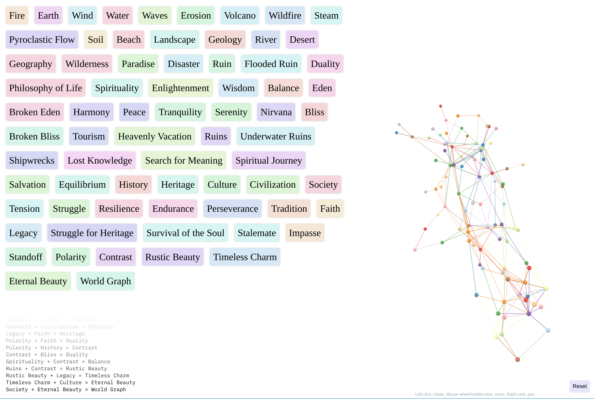
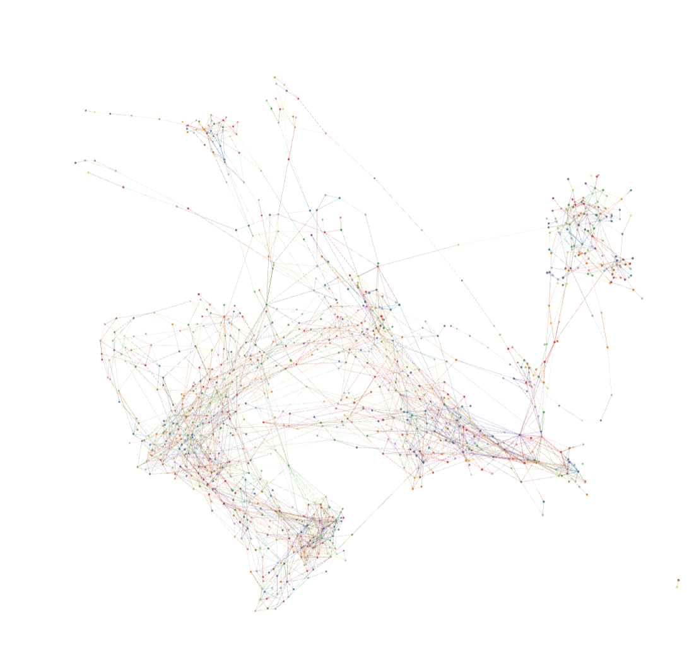

# World Graph

<p align="center">
    
</p>

<hr/>



World Graph is a simplistic reconstruction of the brilliant game [Infinite
Craft](https://neal.fun/infinite-craft/) by [Neal
Agarwal](https://twitter.com/nealagarwal).

The goal is to provide a simple playground that allows for playing with the
concept of Infinite Craft with different models and prompting strategies.

## Getting Started

```shell
git clone https://github.com/functorism/world-graph
cd world-graph
# optionally nix-shell
sqlite3 db.sqlite < migrations/1_init_triple.sql
# optionally run ollama in a Docker container
docker-compose up -d
DATABASE_URL=sqlite:db.sqlite cargo run
```

If you are running Ollama yourself, make sure to `ollama pull neural-chat` first.
